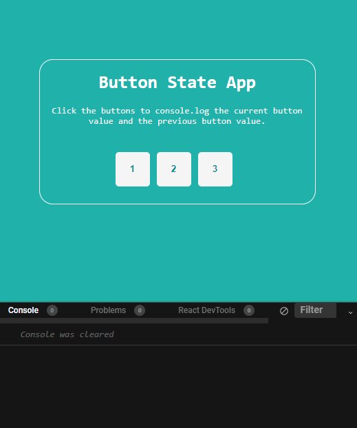

# React Button State App
The React button state app is a simple React app that stores the properties of a value. The value is stored in a object that is outputted to the console, alongside the previous button value. Each time a new button is clicked, the state is updated. This can be used as a building block for more complex apps, and demonstrates React state. 

React state is useful because it allows us to track data and properties in an application.

## Importing `useState` hook
The first step is to import the `useState` hook into the `Button.js` component.

The `useState` hook is imported to retain data between renders, and to update the variable. It allows state tracking in a function component.

```
import { useState } from "react";
```

## Inilialising `useState`

The next step is to initlise the state by calling the `useState` in the function component.

`useState` accepts an initial state and returns two values:

- The current state.
- A function that updates the state.

```

export default function Buttons() {
  // Create and store button value using hooks
  const [btn, btnValue] = useState(null);
  ```
  
  So in this example, we have our `Buttons` function, `btn` stores the state, and `btnValue` updates the state.

## Creating the click event

The next step is to create an event handler `handleClick`. This ensures that when a button is clicked, it will take the curent value of that button. 
```
  // Handling the click event so that the target button when clicked takes the value
  const handleClick = (e) => {
    const getSameValue = e.currentTarget.value;
    btnValue(getSameValue);
    console.log("Current button:", getSameValue, "Previous button:", btn);
  };
```

The `btnValue(getSameValue)` takes the value of the clicked button, and updates the state to that value. So if the previous button had the value of '1' and the clicked button was '2', `btnValue` would update the state of the button compontent so that it now equals '2'.

## Creating the buttons 

The final part of the app is to create the buttons that hold the values, and that call the `handleClick` event handler in the `onClick` property of the button element. 

```
 // Add a value attrbute to the buttons

  return (
    <div>
      <h1>Button State App</h1>
      <p>
        Click the buttons to console.log the current button value and the
        previous button value.
      </p>
      <div>
        <button value="1" onClick={handleClick}>
          1
        </button>
        <button value="2" onClick={handleClick}>
          2
        </button>
        <button value="3" onClick={handleClick}>
          3
        </button>
      </div>
    </div>
  );
```  

Finally, some CSS styling was applied to make the app more visually appealing and user-friendly. 

## Result 




